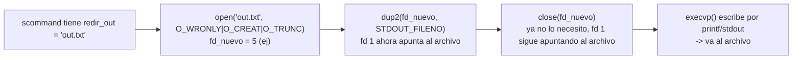
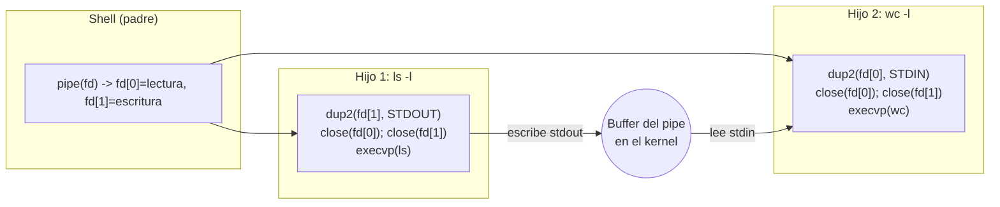
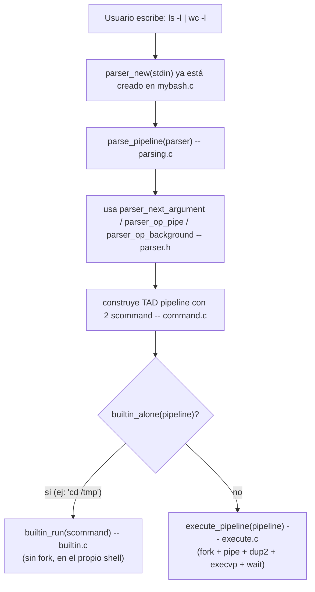

## 1. Fundamentos de Shell y Sistemas Operativos

### 1.1 Rol del Shell
El shell es un **intérprete de línea de comandos**: un programa de espacio de usuario que lee texto que escribe el usuario, lo interpreta como una orden (comando + argumentos + operadores) y le pide al sistema operativo que la ejecute. El shell **no ejecuta el trabajo pesado él mismo** (salvo builtins); delega la ejecución real a otros procesos.

### 1.2 Shell vs. Kernel

| | Shell | Kernel |
|---|---|---|
| Espacio | Usuario | Kernel (privilegiado) |
| Rol | Traduce comandos de texto a syscalls | Ejecuta las syscalls, gestiona procesos, memoria, archivos |
| Ejemplo | Interpreta `ls -l \| wc -l` | Crea los procesos, los pipes, hace el scheduling |

**Idea clave:** el shell es un *cliente* del kernel. Todo lo que el shell "hace" en términos de crear procesos, redirigir E/S o comunicar comandos, en realidad lo pide al kernel a través de **syscalls** (`fork`, `execvp`, `pipe`, `open`, `dup2`, `wait`, etc.). El shell traduce; el kernel ejecuta.

### 1.3 Ciclo REPL
**REPL = Read - Evaluate - Print - Loop**

| Fase     | Tarea                                                                      |
| -------- | -------------------------------------------------------------------------- |
| Read     | Leer la línea de entrada del usuario y parsea el texto                     |
| Evaluate | Ejecutar el comando (fork/exec, pipes, redirecciones)                      |
| Print    | Mostrar resultado (en este caso lo hace el propio proceso hijo vía stdout) |
| Loop     | Volver a mostrar el prompt y repetir                                       |

En `mybash.c` el ciclo REPL es literalmente el `while(!quit)`:

```c
input = parser_new(stdin);
while (!quit) {
    show_prompt();          // parte del "print" del prompt (no del resultado)
    // pipe = parse_pipeline(input);   <- READ (falta descomentar)
    quit = parser_at_eof(input);
    /* COMPLETAR: acá iría EVALUATE -> execute_pipeline(pipe) */
}
parser_destroy(input);
```
 
### 1.4 Comandos Internos (Builtins) vs. Externos

|                | Builtin                                                                                                        | Externo                                         |
| -------------- | -------------------------------------------------------------------------------------------------------------- | ----------------------------------------------- |
| Ejecución      | Función C dentro del propio proceso del shell                                                                  | Nuevo proceso vía `fork()` + `execvp()`         |
| Por qué existe | Porque modifica el **estado del propio shell** (su directorio actual, o debe terminar el propio proceso shell) | Es un programa aparte en el sistema de archivos |
| Ejemplos       | `cd`, `exit`, `export`, `help`                                                                                 | `ls`, `grep`, `wc`, `gzip`                      |

**Razón de ser de los builtins:** `cd` cambia el directorio de trabajo del proceso que lo ejecuta (`chdir()`). Si `cd` se ejecutara como proceso hijo (fork+exec), cambiaría el directorio *del hijo*, que muere inmediatamente después — el shell padre nunca vería el cambio. Por eso `cd` **tiene** que ejecutarse en el mismo proceso del shell. Lo mismo pasa con `exit` (tiene que terminar el proceso del shell, no uno hijo) y con `export` (variables de entorno del propio shell).

En el código, esto se resuelve con una tabla de despacho en `builtin.c`:

```c
struct internal_commands {
    const char *name;
    void (*handler)(scommand);
};

static const struct internal_commands COMMANDS_TABLE[] = {
    {"cd",   handle_cd},
    {"help", handle_help},
    {"exit", handle_exit},
    {NULL,   NULL} // Terminador (sentinela)
};
```

- `builtin_is_internal(scommand cmd)`: recorre `COMMANDS_TABLE` comparando `scommand_front(cmd)` (el nombre del comando) con `strcmp`.
- `builtin_alone(pipeline p)`: es interno **y** además es el único comando del pipeline (`pipeline_length(p) == 1`). Esto importa porque un builtin dentro de un pipe (ej. `cd /tmp | ls`) no tiene mucho sentido si se ejecuta en un proceso hijo — por eso el diseño solo trata como "builtin real" al caso en que está solo.
- `builtin_run(scommand cmd)`: busca el handler en la tabla y lo ejecuta **en el proceso actual**, sin fork.

`handle_cd` es el ejemplo perfecto de por qué existen los builtins:
```c
void handle_cd(scommand cmd) {
    scommand_pop_front(cmd);               // saco "cd", queda el path (o vacío)
    char *path = !scommand_is_empty(cmd) ? scommand_front(cmd) : getenv("HOME");
    if (path != NULL && chdir(path) != 0) {
        perror("cd");
    }
}
```

---

## 2. Gestión de Procesos

### 2.1 `fork()`

```c
pid_t fork(void);
```
- Crea un **proceso hijo** que es una copia (casi) idéntica del proceso padre: mismo código, mismo heap/stack (en la práctica, copy-on-write), mismos descriptores de archivo abiertos.
- **Valores de retorno** (es la clave de todo el modelo):
  - En el **proceso hijo**: `fork()` devuelve **0**.
  - En el **proceso padre**: `fork()` devuelve el **PID del hijo** (> 0).
  - Si falla: devuelve **-1** (no se pudo crear el proceso).
- Como ambos procesos siguen ejecutando desde el mismo punto (el `return` de `fork()`), el patrón típico es un `if`:

```c
pid_t pid = fork();
if (pid < 0) {
    perror("Error en la creacion de fork");
    exit(EXIT_FAILURE);
} else if (pid == 0) {
    // Código que corre SOLO en el hijo
} else {
    // Código que corre SOLO en el padre (pid == PID del hijo)
}
```

Esto es exactamente lo que hace `execute_pipeline()` en `execute.c` dentro del `for` que recorre cada comando del pipeline.

### 2.2 `execvp()`

```c
int execvp(const char *file, char *const argv[]);
```
- **Reemplaza la imagen del proceso actual** por un nuevo programa: mismo PID, pero código, datos, stack y heap nuevos, pertenecientes al programa que se está por ejecutar.
- Si `execvp` tiene éxito, **nunca retorna** (el proceso ya es otro programa). Si retorna, es porque **falló** (por eso siempre va seguido de `perror` + `exit`).
- `argvp` incluye una variante que busca en el `PATH` (`v` = vector de argumentos, `p` = usa `PATH`), a diferencia de `execv`.
- `argv[0]` debe ser el nombre del comando y el arreglo debe terminar en `NULL` (por eso en `cmd_to_args()` se hace `args[tam] = NULL;`).

**Combinación fork() + execvp():** es el patrón central de cualquier shell: el padre hace `fork()`, y el **hijo** llama a `execvp()` para convertirse en el programa pedido, mientras el padre sigue siendo el shell.

```c
if (pid == 0) {
    // ... (redirecciones) ...
    char **args = cmd_to_args(cmd);
    execvp(args[0], args);
    // Solo se llega acá si execvp() falló
    perror("Error en la ejecucion de execvp()");
    exit(EXIT_FAILURE);
}
```

### 2.3 `wait()` y `waitpid()`

```c
pid_t wait(int *wstatus);
pid_t waitpid(pid_t pid, int *wstatus, int options);
```
- Sirven para que el proceso padre **se bloquee** hasta que un hijo termine, y así pueda recoger su estado de finalización.
- `wait(NULL)`: espera a **cualquier** hijo (no importa cuál termine primero). Es lo que usa `execute_pipeline()`:
```c
for (int i = 0; i < tam; i++) {
    wait(NULL);
}
```
- `waitpid(pid, &status, opciones)`: permite esperar a un hijo **específico** (por su PID) y pasar opciones como `WNOHANG` (no bloquear si el hijo no terminó todavía). Es la versión "fina" de `wait()`.

### 2.4 Procesos Zombie
- Un proceso se convierte en **zombie** cuando termina su ejecución (llamó a `exit()` o terminó su `main`) pero **su padre todavía no llamó a `wait()`/`waitpid()`** para leer su código de salida.
- El proceso zombie ya liberó casi todos sus recursos (memoria, archivos), pero el kernel **mantiene su entrada en la tabla de procesos** (con su PID y código de salida) hasta que el padre lo "recoja".
- **Por qué ocurren:** el kernel necesita guardar el estado de salida hasta que alguien lo pida; si el padre nunca llama a `wait()`, ese proceso queda zombie para siempre (o hasta que el padre termine, momento en el cual el zombie es "adoptado" por `init`/PID 1, quien sí hace wait automáticamente).
- **Cómo se evitan:** llamando a `wait()` o `waitpid()` después de cada `fork()` que se quiera sincronizar. En `execute_pipeline()`, el bucle final de `wait(NULL)` (uno por cada comando del pipeline) es exactamente lo que evita que los hijos queden zombies.

### 2.5 Ejecución Foreground vs. Background (`&`)

|             | Foreground                                                                                                       | Background (`&`)                                                                                                                    |
| ----------- | ---------------------------------------------------------------------------------------------------------------- | ----------------------------------------------------------------------------------------------------------------------------------- |
| Shell       | Llama a `wait()`/`waitpid()` y se bloquea hasta que el hijo termine                                              | **No** llama a `wait()` inmediatamente: sigue mostrando el prompt                                                                   |
| Paralelismo | El shell (padre) y el comando (hijo) NO corren en paralelo desde el punto de vista del usuario (el shell espera) | El shell (padre) y el comando (hijo) corren **en paralelo**: el usuario puede seguir tipeando comandos mientras el background corre |

En el TAD `pipeline`, esto se representa con el campo `wait` (booleano) de `struct pipeline_s`, seteado por `pipeline_set_wait()`. El parser detecta el operador `&` (`parser_op_background()`) y, si aparece, hace `pipeline_set_wait(result, false)`.

---

## 3. Comunicación Entre Procesos (IPC) y Redirección de E/S

### 3.1 Descriptores de Archivo
Un **descriptor de archivo (fd)** es un entero que el proceso usa como "manija" para leer/escribir sobre un archivo, pipe, socket, etc. Todo proceso arranca con 3 descriptores estándar abiertos:

| fd | Nombre | Constante | Uso |
|---|---|---|---|
| 0 | stdin  | `STDIN_FILENO`  | entrada estándar |
| 1 | stdout | `STDOUT_FILENO` | salida estándar |
| 2 | stderr | `STDERR_FILENO` | salida de error |

### 3.2 Pipes (`|`)
- **Concepto:** un pipe conecta el `stdout` de un proceso con el `stdin` de otro, formando un buffer FIFO en el kernel entre ambos.

```c
int pipe(int pipefd[2]);
```
- Crea **dos descriptores** en el arreglo que se le pasa:
  - `pipefd[0]`: extremo de **lectura**.
  - `pipefd[1]`: extremo de **escritura**.
- Devuelve `0` si tuvo éxito, `-1` si falló.

En `execute_pipeline()`, para un pipeline de `tam` comandos se necesitan `tam - 1` pipes:
```c
int cant_pipes = tam - 1;
int (*file_descriptor)[2] = malloc(cant_pipes * sizeof(int[2]));
for (int i = 0; i < cant_pipes; i++) {
    if (pipe(file_descriptor[i]) == -1) { perror(...); exit(EXIT_FAILURE); }
}
```

### 3.3 Redirección de E/S

**Operadores** (según la consigna teórica): `>` (salida, trunca), `<` (entrada), `>>` (salida, agrega), `2>` (redirección de stderr).

**Syscalls involucradas:**

```c
int open(const char *pathname, int flags, ...);
int close(int fd);
int dup(int oldfd);
int dup2(int oldfd, int newfd);
```

| Syscall              | Propósito en la redirección                                                                                                                                                                                          |
| -------------------- | -------------------------------------------------------------------------------------------------------------------------------------------------------------------------------------------------------------------- |
| `open()`             | Abre (o crea) el archivo de redirección y devuelve un nuevo fd apuntando a él                                                                                                                                        |
| `dup2(oldfd, newfd)` | Hace que `newfd` (ej. `STDIN_FILENO` o `STDOUT_FILENO`) pase a apuntar **a lo mismo** que `oldfd`. Cierra `newfd` primero si ya estaba abierto. Es la syscall clave: "duplica" el descriptor sobre el estándar       |
| `close()`            | Cierra el descriptor que quedó "de más" tras el `dup2` (el que abrió `open()`, o el extremo del pipe que ya no se usa), para no dejar descriptores colgados                                                          |
| `dup(oldfd)`         | Similar a `dup2`, pero devuelve el **primer** fd libre disponible (no se puede elegir el destino). En este laboratorio se usa `dup2` porque necesitamos apuntar exactamente a 0/1, no a "cualquier" descriptor libre |

**Ejemplo real, redirección de entrada (`<`) en `execute_pipeline()`:**
```c
if (scommand_get_redir_in(cmd) != NULL) {
    int entrada = open(scommand_get_redir_in(cmd), O_RDONLY);
    if (entrada == -1) { 
	    perror("Error al abrir archivo de entrada"); 
	    exit(EXIT_FAILURE); 
    }
    dup2(entrada, STDIN_FILENO);   // STDIN ahora apunta al archivo
    close(entrada);                 // cierro el fd "extra" que abrió open()
} else if (i > 0) {
    dup2(file_descriptor[i - 1][0], STDIN_FILENO);  // conecto con el pipe anterior
}
```

**Ejemplo real, redirección de salida (`>`) solo en el último comando:**
```c
if (scommand_get_redir_out(cmd) != NULL && i == cant_pipes) {
    int salida = open(scommand_get_redir_out(cmd), O_WRONLY | O_CREAT | O_TRUNC, 0644);
    dup2(salida, STDOUT_FILENO);
    close(salida);
} else if (i < cant_pipes) {
    dup2(file_descriptor[i][1], STDOUT_FILENO);  // conecto con el pipe siguiente
}
```

Después de configurar `stdin`/`stdout`, **hay que cerrar todos los extremos de todos los pipes** en cada hijo (incluso los que no usó), porque los descriptores se heredan de `fork()` y si quedan abiertos de más, los procesos lectores nunca ven un EOF (el pipe nunca se "cierra" del todo mientras alguien tenga el extremo de escritura abierto):
```c
for (int j = 0; j < cant_pipes; j++) {
    close(file_descriptor[j][0]);
    close(file_descriptor[j][1]);
}
```

### 3.4 Diagrama: redirección con `open()` + `dup2()` + `close()`



### 3.5 Diagrama: pipe entre dos comandos



---

## 4. Análisis de Comandos y Secuencias de Syscalls

**Método general para deducir la secuencia:**
1. ¿Cuántos comandos hay (separados por `|`)? → esa cantidad de `fork()` + `execvp()`.
2. ¿Hay más de un comando? → `(cantidad de comandos - 1)` llamadas a `pipe()`, hechas **antes** de forkear.
3. ¿Hay redirección (`<`, `>`)? → `open()` + `dup2()` + `close()` en el hijo correspondiente, antes del `execvp()`.
4. ¿Termina en `&`? → el padre **no** llama a `wait()` para ese pipeline (sigue con el prompt).
5. Al final (si no es background) → tantos `wait()` como procesos hijo se hayan creado.

### 4.1 Comando simple: `gzip Lab1G04.tar`
```
fork()
  hijo: execvp("gzip", ["gzip","Lab1G04.tar",NULL])
padre: wait(NULL)
```

### 4.2 Con redirección: `ls -l > out.txt`
```
fork()
  hijo: open("out.txt", O_WRONLY|O_CREAT|O_TRUNC)
        dup2(fd, STDOUT_FILENO)
        close(fd)
        execvp("ls", ["ls","-l",NULL])
padre: wait(NULL)
```

### 4.3 En background: `xeyes &`
```
fork()
  hijo: execvp("xeyes", ["xeyes",NULL])
padre: (NO llama a wait — sigue mostrando el prompt)
```

### 4.4 Con pipe: `ls -l | wc -l`
```
pipe(fd)                          // fd[0]=lectura, fd[1]=escritura

fork()  -> hijo 1 (ls -l)
  dup2(fd[1], STDOUT_FILENO); close(fd[0]); close(fd[1])
  execvp("ls", ["ls","-l",NULL])

fork()  -> hijo 2 (wc -l)
  dup2(fd[0], STDIN_FILENO); close(fd[0]); close(fd[1])
  execvp("wc", ["wc","-l",NULL])

padre: close(fd[0]); close(fd[1])
       wait(NULL); wait(NULL)
```

### 4.5 Combinado: `cat file.txt | grep 'a' > out.txt &`
```
pipe(fd)

fork() -> hijo 1 (cat file.txt)
  dup2(fd[1], STDOUT_FILENO); close(fd[0]); close(fd[1])
  execvp("cat", ["cat","file.txt",NULL])

fork() -> hijo 2 (grep 'a' > out.txt)
  dup2(fd[0], STDIN_FILENO)                         // entrada: viene del pipe
  open("out.txt", O_WRONLY|O_CREAT|O_TRUNC)
  dup2(fd_out, STDOUT_FILENO); close(fd_out)         // salida: al archivo
  close(fd[0]); close(fd[1])
  execvp("grep", ["grep","a",NULL])

padre: close(fd[0]); close(fd[1])
       (NO wait — es background por el "&")
```

---

## 5. Programación en C y Herramientas del Laboratorio

### 5.1 Representación interna de strings
Un string en C **no es un tipo de dato propio**: es un `char *` (puntero al primer carácter) donde la cadena termina en un carácter nulo `\0`. No hay longitud almacenada aparte; para saber dónde termina hay que recorrer byte a byte hasta encontrar `\0` (por eso `strlen()` es O(n)).

### 5.2 Funciones de `<string.h>`

| Función | Qué hace | Qué devuelve |
|---|---|---|
| `strlen(s)` | Cuenta caracteres hasta el `\0` (sin contarlo) | `size_t` con la longitud |
| `strcpy(dst, src)` | Copia `src` a `dst`, **incluyendo** el `\0` | `dst` |
| `strcat(dst, src)` | Concatena `src` al final de `dst` (busca el `\0` de `dst` y pega ahí) | `dst` |
| `strcmp(s1, s2)` | Compara lexicográficamente | `0` si son iguales; `<0` si `s1<s2`; `>0` si `s1>s2` |

### 5.3 Buffer Overflow
`strcpy()` y `strcat()` **no verifican el tamaño del buffer destino**: si `src` es más larga de lo que `dst` puede contener, se escribe *más allá* de la memoria reservada, corrompiendo memoria adyacente (otras variables, el stack, direcciones de retorno). Esto se llama **buffer overflow** y es una de las vulnerabilidades de seguridad más clásicas en C (puede llevar desde corrupción de datos hasta ejecución de código arbitrario). Por eso se prefieren variantes con límite (`strncpy`, `strncat`) o, como en este laboratorio, funciones a medida que reservan memoria dinámica del tamaño exacto necesario.

### 5.4 `strmerge()` — concatenación segura
Implementada en `strextra.c`:
```c
char * strmerge(char *s1, char *s2) {
    char *merge = NULL;
    size_t len_s1 = strlen(s1);
    size_t len_s2 = strlen(s2);
    assert(s1 != NULL && s2 != NULL);
    merge = calloc(len_s1 + len_s2 + 1, sizeof(char));  // reserva EXACTA + 1 para '\0'
    strncpy(merge, s1, len_s1);
    merge = strncat(merge, s2, len_s2);
    assert(merge != NULL && strlen(merge) == strlen(s1) + strlen(s2));
    return merge;
}
```
**Diferencia clave con `strcat()`:** `strcat(dst, src)` asume que `dst` **ya tiene espacio reservado de sobra** para recibir `src` (si no, hay buffer overflow). `strmerge(s1, s2)` en cambio **reserva memoria nueva** con `calloc()` del tamaño exacto (`len_s1 + len_s2 + 1`), y devuelve un puntero nuevo — nunca modifica `s1` ni `s2` in-place. Por eso es "segura": el tamaño del destino siempre es el correcto porque se calcula, no se asume. El costo es que **el llamador es responsable de hacer `free()`** sobre el resultado (se ve en todo `command.c`, ej. `scommand_to_string()`, donde cada `strmerge` intermedio se libera con `free()` inmediatamente después de usarlo).

### 5.5 Manejo de listas: GLib
`command.c` usa la librería **GLib**, específicamente `GList` (lista doblemente enlazada), para implementar los TADs:
```c
struct scommand_s {
    GList * args;      // lista de argumentos (strings)
    char * redir_in;
    char * redir_out;
};
struct pipeline_s {
    GList * scmds;     // lista de scommand
    bool wait;
};
```
Funciones de GLib usadas: `g_list_append()` (agregar al final), `g_list_length()` (longitud), `g_list_delete_link()` (borrar un nodo puntual), `g_list_free()` / `g_list_free_full()` (liberar toda la lista, esta última liberando también el contenido con una función, en este caso `free`). 

---

## 6. Arquitectura Específica del Laboratorio MyBash

### 6.1 Rol de cada módulo (según el código real)

| Módulo                      | Rol                                                                                                                                                                                                           |
| --------------------------- | ------------------------------------------------------------------------------------------------------------------------------------------------------------------------------------------------------------- |
| `mybash.c`                  | **Ciclo principal (REPL)**: crea el `Parser`, corre el `while` que muestra el prompt, parsea y ejecuta hasta EOF                                                                                              |
| `command.h` / `command.c`   | Define e implementa los **TADs** `scommand` y `pipeline` (estructura de datos pura, sin syscalls de proceso)                                                                                                  |
| `parser.h` (provisto, `.o`) | TAD **opaco** de bajo nivel: tokeniza el archivo de entrada carácter por carácter (`parser_next_argument`, `parser_op_pipe`, `parser_op_background`, `parser_skip_blanks`, `parser_garbage`, `parser_at_eof`) |
| `parsing.h` / `parsing.c`   | **Orquesta** el `parser` para construir un TAD `pipeline` completo a partir del texto (`parse_pipeline`, y la función estática `parse_scommand`)                                                              |
| `execute.h` / `execute.c`   | **Ejecuta** el pipeline: hace fork/exec/pipes/redirecciones/wait, orquestando las syscalls sobre el TAD `pipeline`                                                                                            |
| `builtin.h` / `builtin.c`   | Detecta y ejecuta **comandos internos** (`cd`, `help`, `exit`) sin crear procesos nuevos                                                                                                                      |
| `strextra.h` / `strextra.c` | Utilidad de bajo nivel: `strmerge()`, usada por `command.c` para serializar (`_to_string`)                                                                                                                    |

### 6.2 TAD `scommand`
Representa **un comando simple**: sus argumentos (el primero es el nombre del comando) más, opcionalmente, un archivo de redirección de entrada y otro de salida.

```c
typedef struct scommand_s * scommand;   // tipo opaco

struct scommand_s {
    GList * args;       // "ls" -> "-l" -> "/tmp"
    char * redir_in;    // NULL si no hay "<"
    char * redir_out;   // NULL si no hay ">"
};
```
Interfaz (cola + accesores de redirección): `scommand_new`, `scommand_destroy`, `scommand_push_back`, `scommand_pop_front`, `scommand_set_redir_in/out`, `scommand_is_empty`, `scommand_length`, `scommand_front`, `scommand_get_redir_in/out`, `scommand_to_string`.

Detalle de diseño importante: **el TAD toma posesión de la memoria** que se le pasa (ej. `scommand_push_back(self, argument)` — el `argument` pasa a ser propiedad del TAD, y se libera dentro de `scommand_destroy` con `g_list_free_full(self->args, free)`).

### 6.3 TAD `pipeline`
Representa **una secuencia de `scommand` conectados por pipes**, más un flag de si hay que esperar (`&`).

```c
typedef struct pipeline_s * pipeline;

struct pipeline_s {
    GList * scmds;   // scommand1 -> scommand2 -> ... -> scommandN
    bool wait;        // false si terminó en "&"
};
```
Interfaz: `pipeline_new`, `pipeline_destroy`, `pipeline_push_back`, `pipeline_pop_front` (saca **y destruye** el `scommand` del frente — ver que `execute_pipeline()` usa esto para ir "consumiendo" el pipeline comando por comando), `pipeline_set_wait`/`pipeline_get_wait`, `pipeline_is_empty`, `pipeline_length`, `pipeline_front`, `pipeline_to_string`.

### 6.4 Relación `parser` vs. `parsing`
- **`parser`** (dado, `parser.o` + `lexer.o`) es el TAD de **bajo nivel**: sabe leer caracteres del `FILE *` de entrada y reconocer *tokens* (un argumento normal, una redirección `<`/`>`, el operador `|`, el operador `&`, fin de línea, basura). No sabe nada de `scommand` ni `pipeline`.
- **`parsing.c`** es el módulo que **orquesta** al `parser` para construir las estructuras (`parse_scommand` es estática/privada; `parse_pipeline` es la función pública, declarada en `parsing.h`).

```c
static scommand parse_scommand(Parser p) {
    scommand cmd = scommand_new();
    arg_kind_t arg;
    char *comando = parser_next_argument(p, &arg);
    parser_skip_blanks(p);
    while (comando != NULL) {
        if (arg == ARG_INPUT)       scommand_set_redir_in(cmd, comando);
        else if (arg == ARG_NORMAL) scommand_push_back(cmd, comando);
        else if (arg == ARG_OUTPUT) scommand_set_redir_out(cmd, comando);
        free(comando);   // ojo: acá se libera el string...
        comando = parser_next_argument(p, &arg);
    }
    if (scommand_is_empty(cmd)) { scommand_destroy(cmd); cmd = NULL; }
    return cmd;
}
```
> **Punto fino para el examen:** en `command.h` se aclara que el TAD **se apropia** de las cadenas que recibe (`scommand_push_back`, `scommand_set_redir_in/out` no copian el string, guardan el puntero). Sin embargo, en `parse_scommand` se ve `free(comando)` **después** de cada rama (incluida después de `scommand_push_back(cmd, comando)` y `scommand_set_redir_in(cmd, comando)`). Esto es un buen disparador de pregunta: ¿está bien liberar `comando` ahí, sabiendo que el TAD "toma posesión" de esa memoria? Conviene revisarlo con la cátedra/tests (`make test-parsing`), porque a primera lectura pareciera un doble-uso de memoria (usar-y-liberar lo mismo que el TAD guardó por referencia).

`parse_pipeline()` arma el pipeline completo: parsea un `scommand`, lo agrega al `pipeline`, chequea si sigue un `|` (`parser_op_pipe`) y si es así parsea otro `scommand`, hasta que no haya más pipes o haya error. Al final chequea `&` (`parser_op_background`) para setear `pipeline_set_wait(result, false)`, y consume el resto de la línea con `parser_garbage`.

### 6.5 Flujo completo: de texto a ejecución



### 6.6 Resumen de puntos particulares del código (para repasar antes del examen)
- `cmd_to_args()` en `execute.c` **consume** el `scommand` (hace `scommand_pop_front` mientras arma el arreglo de `argv`), dejándolo vacío — esto es antes de `execvp`, en el proceso **hijo**, así que no afecta al padre.
- La redirección de salida (`>`) solo se aplica en el **último** comando del pipeline (`i == cant_pipes`); en los comandos intermedios, el stdout siempre va al pipe siguiente.
- La redirección de entrada (`<`) se prioriza sobre el pipe anterior: si hay `redir_in`, se usa el archivo; si no, y no es el primer comando (`i > 0`), se usa el pipe.
- El código de `execute_pipeline()` **siempre espera** a todos los hijos (no condiciona el `for` de `wait()` con `pipeline_get_wait()`), aunque el TAD sí modela el background con el flag `wait`. Es un punto para señalar como posible mejora/bug si el examen pide "encontrar problemas en el código".
- `mybash.c` 

---

## 7. Laboratorio 0 — Herramientas de Línea de Comandos (Shell Scripting)

### 7.1 Filtrado y conteo de texto: `grep`, `head`, `wc`

```bash
cat /proc/cpuinfo | grep "name" | head -n 1        # Ejercicio 1
cat /proc/cpuinfo | grep "name" | wc -l            # Ejercicio 2
```

| Comando         | Qué hace                                                                                                                |
| --------------- | ----------------------------------------------------------------------------------------------------------------------- |
| `cat archivo`   | Vuelca el contenido del archivo a stdout (acá `/proc/cpuinfo`, un pseudo-archivo del kernel con info de la CPU)         |
| `grep "patrón"` | Filtra e imprime solo las líneas que matchean el patrón (acá, las líneas que contienen `"name"`, es decir `model name`) |
| `head -n N`     | Devuelve solo las primeras `N` líneas de la entrada                                                                     |
| `wc -l`         | Cuenta líneas de la entrada (`wc` = *word count*; `-l` = contar líneas en vez de palabras/bytes)                        |

**Por qué funciona para contar cores:** `/proc/cpuinfo` tiene un bloque por cada unidad de ejecución (core lógico), y cada bloque tiene una línea `model name`. Contar esas líneas con `grep | wc -l` es contar cores.

### 7.2 Descarga y procesamiento de texto: `curl`, `cut`, `tr`, `sed`

```bash
# Ejercicio 3
curl -s https://.../heroes.csv | cut -d ';' -f2 | tr 'A-Z' 'a-z' | sed -e 's/ /_/g' -e '1d' -e '/^$/d' > superheroes_usuarios.txt
```

| Comando | Qué hace |
|---|---|
| `curl -s URL` | Descarga el contenido de una URL e imprime el body por stdout; `-s` = *silent* (no muestra la barra de progreso) |
| `cut -d ';' -f2` | Corta cada línea usando `;` como delimitador (`-d`) y se queda solo con el campo 2 (`-f2`) — es decir, extrae una "columna" de un CSV |
| `tr 'A-Z' 'a-z'` | *Translate*: reemplaza carácter a carácter el primer conjunto por el segundo (acá, pasa todo a minúsculas) |
| `sed -e 'expr1' -e 'expr2' ...` | *Stream editor*: aplica una o más expresiones de edición línea por línea. Cada `-e` es una expresión distinta |
| `sed 's/ /_/g'` | Sustitución (`s/patrón/reemplazo/flags`): reemplaza espacios por guiones bajos; `g` = *global* (todas las ocurrencias de la línea, no solo la primera) |
| `sed '1d'` | Borra (`d` = delete) la línea 1 (el encabezado del CSV) |
| `sed '/^$/d'` | Borra las líneas vacías (`^$` = regex que matchea "principio de línea seguido inmediatamente de fin de línea", o sea, línea vacía) |
| `> archivo` | Redirección de salida: en vez de imprimir en pantalla, escribe (truncando) en `superheroes_usuarios.txt` |

Esta cadena es un ejemplo perfecto del enunciado del laboratorio de MyBash: **cada `|` conecta el stdout de un comando con el stdin del siguiente**, y el `>` final redirige el stdout del último comando a un archivo — exactamente lo que `execute_pipeline()` implementa a nivel de syscalls (`pipe()`, `dup2()`, `open()`).

### 7.3 Ordenamiento de datos tabulares: `sort`, `awk`

```bash
sort -k 5nr datos/weather_cordoba.in | head -n 1 | awk '{print $1,$2,$3}'   # Ejercicio 4A (máxima)
sort -k 6n  datos/weather_cordoba.in | head -n 1 | awk '{print $1, $2, $3}' # Ejercicio 4B (mínima)
sort -n -k 3 datos/wtaplayers.in                                            # Ejercicio 5
awk '{print $0, $7-$8}' datos/lpf.in | sort -k2,2nr -k9,9nr                  # Ejercicio 6
```

| Comando/Opción            | Qué hace                                                                                                                                                                                                                               |
| ------------------------- | -------------------------------------------------------------------------------------------------------------------------------------------------------------------------------------------------------------------------------------- |
| `sort -k N`               | Ordena usando como clave la columna `N` (por defecto, separada por espacios)                                                                                                                                                           |
| `sort -k Nn`              | Orden **numérico** por la columna `N` (sin la `n`, ordenaría alfabéticamente: "10" < "9")                                                                                                                                              |
| `sort -k Nnr`             | Numérico y **reverso** (descendente) — usado para encontrar el máximo poniendo el `head -n 1` después                                                                                                                                  |
| `sort -k2,2nr -k9,9nr`    | Clave múltiple: ordena primero por la columna 2 (numérico descendente) y, para desempatar, por la columna 9 (también numérico descendente). La sintaxis `N,M` indica "desde el campo N hasta el M" (acá, un solo campo cada vez)       |
| `awk '{print $1,$2,$3}'`  | AWK procesa la entrada línea por línea, separándola en campos `$1`, `$2`, ... (`$0` es la línea completa). Acá imprime solo los primeros 3 campos                                                                                      |
| `awk '{print $0, $7-$8}'` | Imprime la línea completa (`$0`) y le agrega, al final, el resultado de una **operación aritmética entre campos** (columna 7 menos columna 8 — típicamente "goles a favor" menos "goles en contra" para calcular la diferencia de gol) |

**Patrón general (Ejercicio 4):** para encontrar el registro con el valor máximo/mínimo de una columna sin usar un lenguaje de programación completo, se ordena por esa columna (`sort -k`) y se toma la primera línea (`head -n 1`) — es un patrón muy común en scripting de shell.

### 7.4 Expresiones regulares sobre comandos del sistema: `ip`, `grep -oE`, `grep -v`

```bash
ip link show | grep -oE "([a-fA-F0-9]{2}:){5}[a-fA-F0-9]{2}" | grep -v "00:00:00:00:00:00"
```

| Comando/Opción                       | Qué hace                                                                                                                                                         |
| ------------------------------------ | ---------------------------------------------------------------------------------------------------------------------------------------------------------------- |
| `ip link show`                       | Comando de red que lista las interfaces de red del equipo y sus datos (incluida la MAC en formato `link/ether xx:xx:xx:xx:xx:xx`)                                |
| `grep -o "patrón"`                   | Igual que `grep` pero solo imprime la parte de la línea que **matchea** el patrón, no la línea entera                                                            |
| `grep -E "regex"`                    | Usa **regex extendidas** (permite `{n}`, `+`, `?`, `\|` sin tener que escaparlos con `\`)                                                                        |
| `([a-fA-F0-9]{2}:){5}[a-fA-F0-9]{2}` | Regex para una MAC: un grupo de "2 dígitos hexadecimales seguidos de `:`" repetido 5 veces, más un último par de dígitos hex sin `:` al final                    |
| `grep -v "patrón"`                   | Invierte el filtro: imprime las líneas que **no** matchean (acá, descarta la MAC "nula" `00:00:00:00:00:00` que suele aparecer en interfaces virtuales/loopback) |

### 7.5 Manipulación de archivos y expansión de llaves: `mkdir`, `touch`, bucle `for`, `mv`

```bash
mkdir serie_prueba                                    # Ejercicio 8A
touch serie_prueba/fma_S01e{01..10}_es.srt

for i in {01..10}; do                                 # Ejercicio 8B
    mv serie_prueba/fma_S01e${i}_es.srt serie_prueba/fma_S01e${i}.srt
done
```

| Elemento | Qué hace |
|---|---|
| `mkdir dir` | Crea un directorio |
| `touch archivo` | Crea un archivo vacío si no existe (o actualiza su fecha de modificación si ya existe) |
| `{01..10}` | **Brace expansion** de bash: antes de ejecutar el comando, la shell expande esto a `01 02 03 ... 10` (con ceros a la izquierda porque el primer valor los tiene) y genera **un argumento por cada valor** — por eso un solo `touch` crea los 10 archivos |
| `for i in {01..10}; do ... ; done` | Bucle que itera la variable `i` sobre cada valor de la lista expandida, ejecutando el cuerpo una vez por valor |
| `${i}` | Interpolación de variable dentro de un string (útil para no confundir los límites del nombre, ej. `${i}_es` vs. `$i_es` que buscaría una variable llamada `i_es`) |
| `mv origen destino` | Renombra (o mueve) un archivo |

**Diferencia clave con la expansión de brace de `touch` vs. el `for`:** en el Ejercicio 8A, la expansión `{01..10}` se resuelve **una sola vez** y `touch` recibe 10 argumentos de una — no hace falta un loop porque `touch` acepta múltiples archivos en una sola invocación. En el 8B, en cambio, se necesita `for` porque `mv` solo soporta pares origen→destino, no se puede pasar una lista de renombres en un solo comando.

### 7.6 Procesamiento de audio/video: `ffmpeg`

```bash
ffmpeg -i onepiece-skypea.mp4 -ss 00:00:05 -to 00:00:30 -c copy onepiece-skypea-cut.mp4   # Ejercicio 9A
ffmpeg -i luffy.mp3 -i sake-binks.mp3 -filter_complex amix=inputs=2:duration=first one-piece-weird.mp3  # Ejercicio 9B
```

| Opción | Qué hace |
|---|---|
| `-i archivo` | Especifica un archivo de **entrada** (input); se puede repetir para varias entradas |
| `-ss HH:MM:SS` | Punto de **inicio** del recorte (start seek) |
| `-to HH:MM:SS` | Punto de **fin** del recorte |
| `-c copy` | Copia los streams de audio/video **sin recodificar** (mucho más rápido, sin pérdida de calidad, pero solo funciona si el corte no requiere recodificar) |
| `-filter_complex amix=inputs=2:duration=first` | Aplica un filtro complejo de mezcla de audio (`amix`) sobre 2 entradas (`inputs=2`), donde la duración de salida es la de la **primera** entrada (`duration=first`) |

### 7.7 Resumen: operadores de shell usados en el Lab 0

| Operador/Símbolo                               | Significado                                                                                             |
| ---------------------------------------------- | ------------------------------------------------------------------------------------------------------- |
| `\|`                                           | Pipe: conecta stdout de un comando con stdin del siguiente                                              |
| `>`                                            | Redirección de salida (trunca el archivo destino)                                                       |
| `{a..b}`                                       | Brace expansion: genera una secuencia de valores                                                        |
| `${var}`                                       | Expansión/interpolación de variable                                                                     |
| `-` (dentro de opciones como `-l`, `-n`, `-s`) | Flags/opciones de cada comando (no son operadores del shell, son parte de la interfaz de cada programa) |

---

## Apéndice — Tabla rápida de syscalls (firmas de referencia)

```c
pid_t fork(void);
int   execvp(const char *file, char *const argv[]);
pid_t wait(int *wstatus);
pid_t waitpid(pid_t pid, int *wstatus, int options);
int   pipe(int pipefd[2]);
int   open(const char *pathname, int flags, ...);
int   close(int fd);
int   dup(int oldfd);
int   dup2(int oldfd, int newfd);
```

| Syscall | Devuelve en éxito | Devuelve en error |
|---|---|---|
| `fork()` | `0` en el hijo / PID del hijo en el padre | `-1` |
| `execvp()` | (no retorna si tuvo éxito) | `-1` |
| `wait()` / `waitpid()` | PID del hijo que terminó | `-1` |
| `pipe()` | `0` | `-1` |
| `open()` | nuevo fd (≥0) | `-1` |
| `close()` | `0` | `-1` |
| `dup()` / `dup2()` | nuevo fd (≥0) | `-1` |

