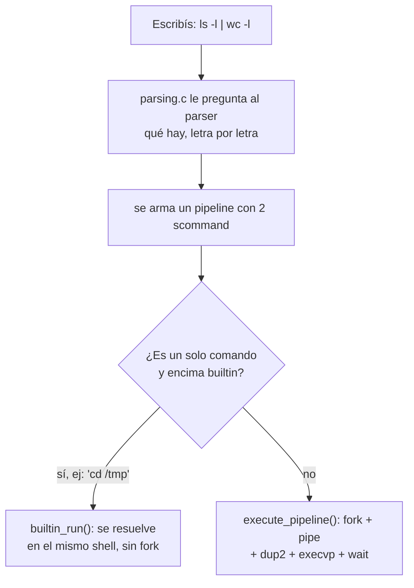

## 1. Qué es un shell, para qué sirve

### 1.1 La idea, en criollo
Pensá en un restaurante. Vos le pedís algo al mozo, el mozo anota el pedido y se lo lleva a la cocina. El mozo no cocina — solo entiende lo que pediste y se lo pasa a quien sí puede hacerlo.

El **shell** es ese mozo. Vos escribís `ls -l`, el shell entiende que eso es un pedido, y se lo pasa al sistema operativo para que lo resuelva. El shell casi nunca hace el trabajo pesado él mismo.

La **cocina**, en esta analogía, es el **kernel**: la parte del sistema operativo que de verdad tiene el poder de crear procesos, leer archivos, hablar con el hardware, etc. El shell le pide cosas al kernel, pero quien las ejecuta de verdad es el kernel.

|            | Shell (el mozo)                                | Kernel (la cocina)                                             |
| ---------- | ---------------------------------------------- | -------------------------------------------------------------- |
| Qué hace   | Entiende lo que escribiste y se lo pide a otro | Hace el trabajo real: crea procesos, maneja archivos y memoria |
| Dónde vive | "Espacio de usuario" (un programa más)         | "Espacio de kernel" (tiene permisos especiales)                |

**Para practicar:** cuando escribís `ls`, el shell no "sabe" listar archivos por arte de magia — le pide al sistema operativo que arranque el programa `ls`, que vive en el disco como cualquier otro programa. Pensá: ¿qué tendría que pasar si el archivo `ls` no existiera en tu computadora? (Pista: el shell te va a avisar que no encuentra el comando — no es que el shell "sepa" listar archivos, depende de que el programa exista).

### 1.2 El shell repite lo mismo una y otra vez (REPL)
Un shell es básicamente un bucle que nunca termina, hasta que le decís `exit`. En cada vuelta hace lo mismo:

1. **Escuchar** lo que escribiste (Read)
2. **Resolverlo** (Evaluate)
3. **Mostrarte** el resultado (Print)
4. **Volver a escuchar** (Loop)

Por eso se lo llama **REPL** (Read-Evaluate-Print-Loop). Es como una charla: escuchás, respondés, y volvés a escuchar.

En `mybash.c`, ese bucle es literalmente esto:

```c
input = parser_new(stdin);
while (!quit) {
    show_prompt();          // esto es el "Print" del prompt, no del resultado
    // pipe = parse_pipeline(input);   <- esto sería el "Read"
    quit = parser_at_eof(input);
    /* Acá falta completar el "Evaluate": execute_pipeline(pipe) */
}
parser_destroy(input);
```

> **Ojo:** este archivo tal cual está subido todavía **no ejecuta nada** — el `parse_pipeline` está comentado y falta el paso de "Evaluate". Es un esqueleto para completar, no algo roto.

**Para practicar:** imaginate que el shell no tuviera este bucle, y que el programa terminara después de ejecutar un solo comando. ¿Qué tendrías que hacer vos, como usuario, para correr un segundo comando? (Respuesta: volver a abrir el programa shell entero, cada vez).

### 1.3 Cosas que el shell resuelve solo (builtins) vs. cosas que delega
Siguiendo con el mozo: hay pedidos chiquitos que puede resolver sin ir a la cocina — como decirte la hora, o traerte el menú de nuevo. Y hay pedidos que sí o sí tiene que llevar a la cocina, porque él solo no puede prepararlos.

Los **comandos internos (builtins)** son esos pedidos chicos: el shell los resuelve él mismo, sin crear ningún proceso nuevo. `cd`, `exit` y `help` son builtins en MyBash.

Los **comandos externos** son todo lo demás (`ls`, `grep`, `wc`, `gzip`...): son programas aparte, guardados en el disco, y el shell tiene que crear un **proceso nuevo** para correrlos.

| | Builtin | Externo |
|---|---|---|
| ¿Quién lo ejecuta? | El shell mismo, con una función en C | Un proceso hijo nuevo |
| Ejemplos | `cd`, `help`, `exit` | `ls`, `grep`, `wc`, `gzip` |

**¿Por qué `cd` tiene que ser builtin sí o sí?** Pensalo así: si le pedís a un mensajero "andá y mudate a la casa de al lado", el que se muda es el mensajero, no vos. Vos seguís en el mismo lugar. Lo mismo pasa si `cd` se ejecutara en un proceso hijo: el hijo cambiaría *su propia* carpeta de trabajo, y un instante después ese hijo termina y desaparece. El shell (el padre) ni se entera, sigue en la carpeta de siempre. Por eso `cd` tiene que correr en el mismo proceso que el shell — es la única forma de que el cambio "pegue" de verdad.

En el código, en vez de escribir un montón de `if / else if` para cada builtin, se usa una tabla que dice "si el nombre es tal, llamá a tal función":

```c
struct internal_commands {
    const char *name;              // el nombre que escribe el usuario
    void (*handler)(scommand);     // qué función hay que llamar
};

static const struct internal_commands COMMANDS_TABLE[] = {
    {"cd",   handle_cd},
    {"help", handle_help},
    {"exit", handle_exit},
    {NULL,   NULL}  // marca el final de la tabla
};
```

La ventaja de esto: si mañana querés agregar un builtin nuevo (por ejemplo `pwd`), no tenés que tocar la lógica que "detecta" builtins — solo agregás una fila nueva a la tabla y escribís la función.

Y así se ve `cd` resuelto, sin fork ni nada raro, una función C normal:
```c
void handle_cd(scommand cmd) {
    scommand_pop_front(cmd);               // saco "cd", queda el path (o nada)
    char *path = !scommand_is_empty(cmd) ? scommand_front(cmd) : getenv("HOME");
    if (path != NULL && chdir(path) != 0) {
        perror("cd");
    }
}
```

---

## 2. Procesos: sacarse una fotocopia y disfrazarse

### 2.1 `fork()` — sacarte una fotocopia de vos mismo
Imaginate que en el momento exacto en que llamás a `fork()`, sacás una fotocopia perfecta de vos mismo: misma memoria, mismo punto en el que estabas parado, todo igual. A partir de ese instante, **hay dos** (el original y la copia) y cada uno sigue viviendo por su cuenta.

```c
pid_t fork(void);
```

La pregunta obvia es: si ambos son "idénticos", ¿cómo sabe cada uno si es el original o la copia? La respuesta está en lo que le devuelve `fork()` a cada uno — es como si cada uno se mirara al espejo después de sacarse la fotocopia:

- La **copia (proceso hijo)** ve un **0**.
- El **original (proceso padre)** ve un número que identifica a la copia (su **PID**, un número > 0).
- Si algo salió mal y no se pudo sacar la fotocopia: devuelve **-1**.

Como el código sigue corriendo en los dos "a la vez" desde ese mismo punto, se usa un `if` para que cada uno sepa qué hacer:

```c
pid_t pid = fork();
if (pid < 0) {
    perror("Error en la creacion de fork");
    exit(EXIT_FAILURE);
} else if (pid == 0) {
    // Esto lo corre SOLO la copia (el hijo)
} else {
    // Esto lo corre SOLO el original (el padre)
}
```

Esto es justo lo que hace `execute_pipeline()` en `execute.c`, una vez por cada comando del pipeline.

### 2.2 `execvp()` — disfrazarte de otro programa
Ahora imaginate que esa fotocopia se pone un disfraz completo, tan completo que deja de ser "vos" y pasa a ser otra persona por dentro y por fuera — conserva el mismo documento de identidad (el mismo número de proceso, el PID), pero todo lo demás cambia: otro código, otra memoria.

```c
int execvp(const char *file, char *const argv[]);
```

Eso es `execvp()`: reemplaza el programa que está corriendo por otro completamente distinto. Si el disfraz sale bien, **no hay vuelta atrás** — la función ni siquiera "vuelve" a tu código, porque tu código ya no existe, ahora sos el otro programa. Si `execvp()` sí devuelve algo, es mala señal: significa que el disfraz falló.

**El combo fork() + execvp() es el corazón de cualquier shell:** el padre se saca una fotocopia de sí mismo (`fork`), y le dice a esa copia "ahora disfrazate de `ls`" (`execvp`). El padre sigue siendo el shell de siempre; el que se disfrazó y "se convirtió en `ls`" fue solo la copia.

```c
if (pid == 0) {
    // ... acá van las redirecciones, si hace falta ...
    char **args = cmd_to_args(cmd);
    execvp(args[0], args);
    // Si llegamos hasta acá, es porque el disfraz falló
    perror("Error en la ejecucion de execvp()");
    exit(EXIT_FAILURE);
}
```

### 2.3 `wait()` — preguntar "¿cómo te fue?"
Si mandás a alguien a hacer un mandado y nunca le preguntás cómo le fue, esa persona técnicamente ya terminó, pero queda "ahí parada" hasta que alguien le pregunte — no se puede ir del todo sin que vos le prestes atención una vez más.

```c
pid_t wait(int *wstatus);
pid_t waitpid(pid_t pid, int *wstatus, int options);
```

Eso es exactamente un **proceso zombie**: un hijo que ya terminó su trabajo, pero cuyo padre todavía no llamó a `wait()` para "cerrarle el caso". El sistema operativo tiene que guardar esa información (cómo terminó) hasta que alguien la pida, así que el proceso queda con una entrada fantasma en la lista de procesos.

`wait(NULL)` es "esperá a que termine cualquiera de mis hijos, y decime cómo le fue" (acá no nos importa el resultado, por eso `NULL`). `waitpid()` es la versión más específica: "esperá a este hijo puntual".

En `execute_pipeline()`, después de crear todos los procesos, el padre le pregunta a cada uno cómo le fue:
```c
for (int i = 0; i < tam; i++) {
    wait(NULL);
}
```
Eso es justamente lo que evita que queden zombies dando vueltas.

### 2.4 Esperar parado vs. seguir con lo tuyo (foreground vs. background)
Cuando corrés un comando normal, el shell **se queda esperando** a que termine antes de mostrarte el prompt de nuevo — como quedarte parado en el mostrador hasta que te traen el pedido. Eso es **foreground**.

Cuando le ponés `&` al final (`sleep 60 &`), le estás diciendo al shell "hacé esto, pero no me hagas esperar, yo sigo con lo mío" — el shell no llama a `wait()` en ese momento, y vos podés seguir escribiendo comandos mientras el otro corre por su cuenta. Eso es **background**.

**Para practicar:** si escribís `sleep 5 &` y en la misma línea después `echo "hola"`, ¿qué se imprime primero? — `hola`, porque el shell no se queda esperando al `sleep`, sigue de largo apenas lo manda a correr.

> **Detalle para mirar en el código:** el TAD `pipeline` sí tiene un campo (`wait`) que guarda si hay que esperar o no. Pero en `execute_pipeline()`, el bucle final de `wait(NULL)` se ejecuta **siempre**, sin fijarse en ese campo. Es decir: la idea de "esperar o no" está pensada en el diseño, pero en este archivo puntual todavía no se usa para decidir si esperar o no. Vale la pena tenerlo en cuenta si te preguntan por posibles mejoras al código.

---

## 3. Cómo hablan entre sí los procesos: pipes y redirecciones

### 3.1 Los tres "caños" de cada proceso
Todo proceso, apenas nace, ya tiene tres "caños" (descriptores de archivo) conectados por default:

| Número | Nombre | Para qué |
|---|---|---|
| 0 | entrada (stdin) | por acá "entra" lo que lee (normalmente, lo que tipeás en el teclado) |
| 1 | salida (stdout) | por acá "sale" lo que imprime (normalmente, la pantalla) |
| 2 | errores (stderr) | por acá "salen" los mensajes de error (también la pantalla, pero es un caño aparte) |

### 3.2 Pipes (`|`) — conectar la salida de uno con la entrada de otro
Un pipe es como una manguera: conecta el caño de salida de un proceso con el caño de entrada de otro. Todo lo que el primero tira por su salida, el segundo lo recibe por su entrada, sin pasar por la pantalla en el medio.

```c
int pipe(int pipefd[2]);
```
Esta syscall te da la manguera hecha: `pipefd[0]` es la punta por donde se **lee**, `pipefd[1]` es la punta por donde se **escribe**.

Si tenés un pipeline de 3 comandos (`a | b | c`), necesitás **2 mangueras** (una entre `a` y `b`, otra entre `b` y `c`) — siempre son "cantidad de comandos menos uno".

### 3.3 Redirecciones — conectar un caño a un balde en vez de a otro proceso
En vez de conectar la manguera a otro proceso, la podés conectar a un **balde** (un archivo).

| Operador | Qué hace, en criollo |
|---|---|
| `>` | Tirá todo lo que salga por acá a este balde. Si el balde ya tenía algo, primero se vacía |
| `>>` | Igual, pero sin vaciar el balde antes — se va acumulando arriba de lo que ya había |
| `<` | En vez de leer del teclado, leé de este balde que ya tiene algo adentro |
| `2>` | Los mensajes de error (no los normales) van a este balde |

En términos técnicos, esto se logra siempre con la misma receta de 3 pasos:

```c
int open(const char *pathname, int flags, ...);  // 1) abrir/crear el balde (archivo)
int dup2(int oldfd, int newfd);                  // 2) pegar el caño estándar al balde
int close(int fd);                                // 3) soltar la "etiqueta" que ya no sirve
```

1. **`open()`**: abre (o crea) el archivo y te da un número (fd) para referirte a él — pensalo como el "número de mesa" con el que identificás al balde recién abierto.
2. **`dup2(viejo, nuevo)`**: hace que el caño estándar (`nuevo`, por ejemplo el caño 1 = salida) apunte **a lo mismo** que apuntaba `viejo` (el balde que acabás de abrir). Después de esto, escribir por el caño 1 es literalmente lo mismo que escribir en el balde.
3. **`close()`**: ya pegaste el caño al balde, así que el número que te dio `open()` al principio ya no hace falta — lo soltás para no dejar cosas abiertas de más.

**Ejemplo pensado paso a paso: `ls -l > out.txt`**
1. `open("out.txt", ...)` → me da, pongamos, el número 3.
2. `dup2(3, 1)` → ahora el caño de salida (1) apunta a `out.txt`.
3. `close(3)` → suelto el número 3, ya no lo necesito (el caño 1 sigue apuntando a `out.txt`).
4. Corre `ls` → todo lo que `ls` imprime (que en realidad escribe por el caño 1) termina en `out.txt`, en vez de en tu pantalla.

**¿Por qué se usa `dup2()` y no `dup()`?** `dup()` te da "el primer número libre que haya", sin que vos elijas cuál. Acá necesitamos algo específico: que el caño **1** (o el 0, o el 2) apunte al balde — no cualquier caño. `dup2()` te deja elegir exactamente a cuál.

Así se ve la redirección de entrada (`<`) en el código real de MyBash:
```c
if (scommand_get_redir_in(cmd) != NULL) {
    int entrada = open(scommand_get_redir_in(cmd), O_RDONLY);
    if (entrada == -1) { perror("Error al abrir archivo de entrada"); exit(EXIT_FAILURE); }
    dup2(entrada, STDIN_FILENO);   // el caño de entrada ahora apunta al archivo
    close(entrada);                 // ya no necesito este número
} else if (i > 0) {
    dup2(file_descriptor[i - 1][0], STDIN_FILENO);  // me conecto con el pipe anterior
}
```

Y la de salida (`>`), que solo se aplica en el **último** comando del pipeline:
```c
if (scommand_get_redir_out(cmd) != NULL && i == cant_pipes) {
    int salida = open(scommand_get_redir_out(cmd), O_WRONLY | O_CREAT | O_TRUNC, 0644);
    dup2(salida, STDOUT_FILENO);
    close(salida);
} else if (i < cant_pipes) {
    dup2(file_descriptor[i][1], STDOUT_FILENO);  // me conecto con el pipe siguiente
}
```

Tiene sentido que la redirección a archivo solo se use en el último comando: en `cat file | grep 'a' > out.txt`, el único que tiene un `>` de verdad es `grep`, que además es el último de la cadena. Los comandos del medio siempre mandan su salida al siguiente pipe, nunca a un archivo.

> **Nota:** el código de este laboratorio solo implementa `<` y `>` (y `>` siempre vacía el balde antes, nunca "acumula"). Si te preguntan por `>>` o `2>`, la única diferencia real sería: para `>>` cambiar la forma de abrir el archivo (para que no lo vacíe, sino que agregue al final); para `2>`, pegar el balde al caño de **errores** en vez de al de salida.

**Para practicar:** pensá qué pasaría si hicieras `dup2()` sin hacer `close()` después. (Respuesta: no rompe nada de inmediato, pero te quedan números de más "reservados" sin usar, que en un programa que corre muchos comandos se van acumulando — no es prolijo y en algún momento se puede quedar sin números disponibles).

Después de armar las conexiones, hay que soltar **todas** las mangueras que quedaron sin usar en cada hijo — si no, el otro extremo nunca se entera de que "ya no viene más agua", porque alguien sigue teniendo la manguera agarrada aunque no la use:
```c
for (int j = 0; j < cant_pipes; j++) {
    close(file_descriptor[j][0]);
    close(file_descriptor[j][1]);
}
```

---

## 4. Practicando: de un comando escrito a lo que hace el sistema operativo por dentro

La forma de resolver esto siempre es la misma receta:
1. ¿Cuántos comandos hay, separados por `|`? Esa es la cantidad de fotocopias (`fork`) y disfraces (`execvp`) que hacen falta.
2. Si hay más de uno, hacen falta mangueras (`pipe`) — una menos que la cantidad de comandos.
3. ¿Hay `<` o `>`? Ahí va la recetita de `open` + `dup2` + `close`.
4. ¿Termina en `&`? El padre no se queda esperando.
5. Si no es background, al final el padre pregunta "¿cómo les fue?" a cada hijo (`wait`).

### `gzip Lab1G04.tar`
```
fork()
  hijo: execvp("gzip", ["gzip","Lab1G04.tar",NULL])
padre: wait(NULL)
```

### `ls -l > out.txt`
```
fork()
  hijo: open("out.txt", ...) -> dup2(fd, salida) -> close(fd)
        execvp("ls", ["ls","-l",NULL])
padre: wait(NULL)
```

### `xeyes &`
```
fork()
  hijo: execvp("xeyes", ["xeyes",NULL])
padre: (no espera, sigue de largo)
```

### `ls -l | wc -l`
```
pipe(fd)   // fd[0]=entrada de la manguera, fd[1]=salida

fork() -> hijo 1 (ls -l)
  dup2(fd[1], salida); cierra fd[0] y fd[1]
  execvp("ls", ["ls","-l",NULL])

fork() -> hijo 2 (wc -l)
  dup2(fd[0], entrada); cierra fd[0] y fd[1]
  execvp("wc", ["wc","-l",NULL])

padre: cierra fd[0] y fd[1]
       wait(NULL); wait(NULL)
```

### `cat file.txt | grep 'a' > out.txt &`
```
pipe(fd)

fork() -> hijo 1 (cat file.txt)
  dup2(fd[1], salida); cierra fd[0] y fd[1]
  execvp("cat", ["cat","file.txt",NULL])

fork() -> hijo 2 (grep 'a' > out.txt)
  dup2(fd[0], entrada)                        // lee del pipe
  open("out.txt", ...) -> dup2(fd_out, salida) -> close(fd_out)  // escribe al archivo
  cierra fd[0] y fd[1]
  execvp("grep", ["grep","a",NULL])

padre: cierra fd[0] y fd[1]
       (no espera, porque terminó en "&")
```

---

## 5. Un poco de C: cómo se guardan las palabras (strings)

### 5.1 Cómo es un string por dentro
En C, un string no es un tipo de dato "de verdad", es solo una fila de casilleros de memoria, uno por letra, y el último casillero tiene un cartelito especial (`\0`) que dice "acá se terminó la palabra". No hay ningún lugar donde esté anotado "esta palabra mide 5 letras" — si querés saber la longitud, tenés que ir casillero por casillero contando hasta encontrar el cartelito.

### 5.2 Las funciones más comunes

| Función | Qué hace |
|---|---|
| `strlen(s)` | Cuenta cuántas letras hay hasta el cartelito de "fin" |
| `strcpy(dst, src)` | Copia una palabra dentro de otra fila de casilleros |
| `strcat(dst, src)` | Pega una palabra al final de otra |
| `strcmp(s1, s2)` | Compara dos palabras: te dice si son iguales, o cuál "va antes" alfabéticamente |

### 5.3 El problema del buffer overflow
Ahora, `strcpy()` y `strcat()` tienen un problema: **no se fijan si hay lugar suficiente**. Es como servir agua en un vaso sin fijarte cuánto entra — si servís de más, se derrama sobre la mesa y moja lo que había al lado.

Cuando eso pasa con memoria de la computadora, "lo que había al lado" puede ser otra variable, o información importante del programa — y ese derrame se llama **buffer overflow**. Es uno de los errores de seguridad más conocidos en programas escritos en C, porque a veces alguien puede aprovechar ese "derrame" a propósito para romper o tomar control del programa.

### 5.4 `strmerge()` — la versión "sin derrame" de `strcat`
En vez de intentar meter agua extra en un vaso que ya estaba armado, `strmerge()` primero **mide cuánta agua va a entrar en total**, fabrica un vaso nuevo exactamente de ese tamaño, y recién ahí sirve las dos palabras juntas:

```c
char * strmerge(char *s1, char *s2) {
    char *merge = NULL;
    size_t len_s1 = strlen(s1);
    size_t len_s2 = strlen(s2);
    merge = calloc(len_s1 + len_s2 + 1, sizeof(char));  // vaso del tamaño justo (+1 para el cartelito de fin)
    strncpy(merge, s1, len_s1);
    merge = strncat(merge, s2, len_s2);
    return merge;
}
```

La diferencia con `strcat()`: `strcat()` asume que el vaso destino ya tiene lugar de sobra (si no, hay derrame). `strmerge()` nunca asume nada — fabrica el vaso del tamaño exacto cada vez, así que nunca se puede desbordar. El costo es que ese vaso nuevo hay que acordarse de tirarlo después con `free()` cuando ya no se usa (en `command.c` se ve esto todo el tiempo).

### 5.5 Listas: GLib
Para no tener que armar listas enlazadas a mano, el código usa una librería ya hecha, **GLib**, con su tipo `GList`. Es la lista que guarda, por ejemplo, los argumentos de un comando (`"ls" -> "-l" -> "/tmp"`).

```c
struct scommand_s {
    GList * args;       // la lista de palabras del comando
    char * redir_in;
    char * redir_out;
};
```

---

## 6. Cómo está armado MyBash por dentro

Pensá en MyBash como una pequeña fábrica con estaciones, cada una con un trabajo bien puntual:

| Módulo | Su trabajo, en criollo |
|---|---|
| `mybash.c` | La línea principal: recibe el pedido, lo manda a las demás estaciones, muestra el prompt de nuevo |
| `parser.h` | La estación que entiende letra por letra lo que escribiste (viene ya hecha, no hay que tocarla) |
| `parsing.c` | Traduce lo que entendió el parser a una estructura ordenada: "este es el comando, estos son los argumentos, esta es la redirección" |
| `command.c/h` | Define cómo se guarda un comando y un pipeline en memoria |
| `execute.c` | La que de verdad hace las fotocopias (`fork`), los disfraces (`execvp`), las mangueras (`pipe`) y las redirecciones |
| `builtin.c` | La barra de atención rápida: resuelve `cd`, `help`, `exit` sin mandar nada a la fábrica |

### 6.1 `scommand` — un comando simple
Es la estructura que guarda **un** comando con sus argumentos, y opcionalmente a qué archivo redirige su entrada o su salida.

```c
struct scommand_s {
    GList * args;       // ej: "ls" -> "-l" -> "/tmp"
    char * redir_in;    // NULL si no hay "<"
    char * redir_out;   // NULL si no hay ">"
};
```

### 6.2 `pipeline` — una cadena de comandos
Es una lista de `scommand`, uno atrás del otro, más un dato que dice si hay que esperar o no (si terminó en `&`).

```c
struct pipeline_s {
    GList * scmds;   // scommand1 -> scommand2 -> ...
    bool wait;        // false si terminó en "&"
};
```

### 6.3 `parser` vs. `parsing` — ojo, no son lo mismo
- **`parser`**: es la estación de bajo nivel, la que entiende **letra por letra** lo que escribiste (te dice "esto es una palabra normal", "esto es una redirección", "esto es un pipe"). Viene ya hecha por la cátedra, no sabe nada de `scommand` ni `pipeline`.
- **`parsing.c`**: es quien **usa** al parser para armar la estructura completa. Le va preguntando al parser "¿qué sigue?" una y otra vez, y con esas respuestas arma el `pipeline` entero.

```c
static scommand parse_scommand(Parser p) {
    scommand cmd = scommand_new();
    arg_kind_t arg;
    char *comando = parser_next_argument(p, &arg);
    while (comando != NULL) {
        if (arg == ARG_INPUT)       scommand_set_redir_in(cmd, comando);
        else if (arg == ARG_NORMAL) scommand_push_back(cmd, comando);
        else if (arg == ARG_OUTPUT) scommand_set_redir_out(cmd, comando);
        free(comando);
        comando = parser_next_argument(p, &arg);
    }
    return cmd;
}
```

> **Detalle fino, para pensar:** en `command.h` se aclara que el `scommand` "se queda con" (toma posesión de) cada palabra que le pasás — no la copia, guarda el mismo puntero. Pero en el código de arriba, justo después de guardarla, se hace `free(comando)`. Vale la pena revisarlo con calma (con `make test-parsing`) porque a primera vista parece que se libera algo que el `scommand` todavía necesita.

### 6.4 El camino completo, de texto a ejecución



### 6.5 Cosas para tener frescas antes del examen
- `mybash.c`, tal cual está subido, todavía **no llama** a `parse_pipeline` ni a `execute_pipeline` — es un esqueleto para completar.
- La redirección de salida (`>`) solo se usa en el **último** comando de un pipeline; los del medio siempre van al pipe siguiente.
- `execute_pipeline()` siempre espera a todos los hijos con `wait()`, sin fijarse en si el pipeline debía correr en segundo plano — aunque el dato (`wait` del pipeline) sí existe.

---

## 7. El laboratorio anterior (Lab 0): usando la terminal como usuario

Antes de programar un shell, este laboratorio previo es sobre **usarlo** bien: encadenar herramientas con `|` para resolver problemas de texto y datos. Son los mismos comandos externos que MyBash tiene que poder correr.

### 7.1 Filtrar y contar: `grep`, `head`, `wc`
```bash
cat /proc/cpuinfo | grep "name" | head -n 1     # el modelo del procesador
cat /proc/cpuinfo | grep "name" | wc -l          # cuántos cores tiene
```
- `cat archivo`: muestra el contenido de un archivo (acá, un archivo especial del sistema con info de la CPU).
- `grep "palabra"`: se queda solo con las líneas que contienen esa palabra.
- `head -n 1`: se queda solo con la primera línea.
- `wc -l`: cuenta cuántas líneas le llegaron.

Como cada core tiene su propia línea con el modelo, contar esas líneas es contar cores.

### 7.2 Bajar y limpiar texto: `curl`, `cut`, `tr`, `sed`
```bash
curl -s URL | cut -d ';' -f2 | tr 'A-Z' 'a-z' | sed -e 's/ /_/g' -e '1d' -e '/^$/d' > usuarios.txt
```
- `curl -s URL`: baja el contenido de una página o archivo de internet.
- `cut -d ';' -f2`: de un archivo tipo tabla separado por `;`, se queda solo con la columna 2.
- `tr 'A-Z' 'a-z'`: pasa todo a minúsculas.
- `sed`: va editando línea por línea. `s/ /_/g` cambia espacios por guiones bajos; `1d` borra la primera línea (el título de la tabla); `/^$/d` borra las líneas que quedaron vacías.
- `> usuarios.txt`: en vez de mostrar el resultado en pantalla, lo guarda en un archivo.

### 7.3 Ordenar tablas: `sort`, `awk`
```bash
sort -k 5nr datos.in | head -n 1     # el que tiene el valor más alto en la columna 5
awk '{print $0, $7-$8}' tabla.in     # le agrega a cada línea el resultado de restar dos columnas
```
- `sort -k N`: ordena usando la columna N como criterio.
- La `n` es para que ordene como número (si no, "10" queda antes que "9", porque compara letra por letra); la `r` es para que ordene de mayor a menor.
- Buscar el máximo/mínimo de una columna sin escribir un programa entero: ordenás por esa columna y te quedás con la primera línea (`head -n 1`).
- `awk`: separa cada línea en columnas (`$1`, `$2`, ...) y te deja hacer cosas con ellas, como sumarlas o restarlas.

### 7.4 Buscar patrones: `grep -oE`, `grep -v`
```bash
ip link show | grep -oE "([a-fA-F0-9]{2}:){5}[a-fA-F0-9]{2}" | grep -v "00:00:00:00:00:00"
```
- `ip link show`: te muestra información de las conexiones de red, incluida la dirección MAC.
- `grep -o "patrón"`: en vez de mostrar toda la línea, muestra solo la parte que matchea.
- `grep -v "patrón"`: al revés, muestra todo lo que **no** matchea (acá, descarta una MAC "vacía" que suele aparecer de más).

### 7.5 Crear muchos archivos de una: `{01..10}`, `for`
```bash
touch serie{01..10}.srt
for i in {01..10}; do mv serie${i}_es.srt serie${i}.srt; done
```
- `{01..10}` es una forma corta de escribir `01 02 03 ... 10` — la terminal lo expande antes de correr el comando, así que `touch` recibe 10 nombres de archivo de una sola vez.
- El `for` hace falta cuando el comando (acá `mv`) solo puede trabajar de a un archivo por vez — no existe una forma de renombrar 10 archivos en un solo `mv`.

### 7.6 Video y audio: `ffmpeg`
```bash
ffmpeg -i video.mp4 -ss 00:00:05 -to 00:00:30 -c copy recorte.mp4
```
- `-i`: el archivo de entrada.
- `-ss` / `-to`: desde dónde hasta dónde recortar.
- `-c copy`: copia el video tal cual, sin reprocesarlo (más rápido, sin perder calidad).

---

## Apéndice — Tabla rápida de syscalls

| Syscall | Analogía | Devuelve si sale bien | Devuelve si falla |
|---|---|---|---|
| `fork()` | Sacarte una fotocopia de vos mismo | `0` en la copia, el "número de documento" de la copia en el original | `-1` |
| `execvp()` | Disfrazarte de otro programa, sin vuelta atrás | (si sale bien, no vuelve) | `-1` |
| `wait()` / `waitpid()` | Preguntarle a un hijo "¿cómo te fue?" | el identificador del hijo que terminó | `-1` |
| `pipe()` | Conseguir una manguera con dos puntas | `0` | `-1` |
| `open()` | Abrir o crear un balde | un número para referirte al balde | `-1` |
| `close()` | Soltar un balde que ya no usás | `0` | `-1` |
| `dup()` / `dup2()` | Pegar un caño a un balde | un número de caño | `-1` |

```c
pid_t fork(void);
int   execvp(const char *file, char *const argv[]);
pid_t wait(int *wstatus);
pid_t waitpid(pid_t pid, int *wstatus, int options);
int   pipe(int pipefd[2]);
int   open(const char *pathname, int flags, ...);
int   close(int fd);
int   dup(int oldfd);
int   dup2(int oldfd, int newfd);
```
