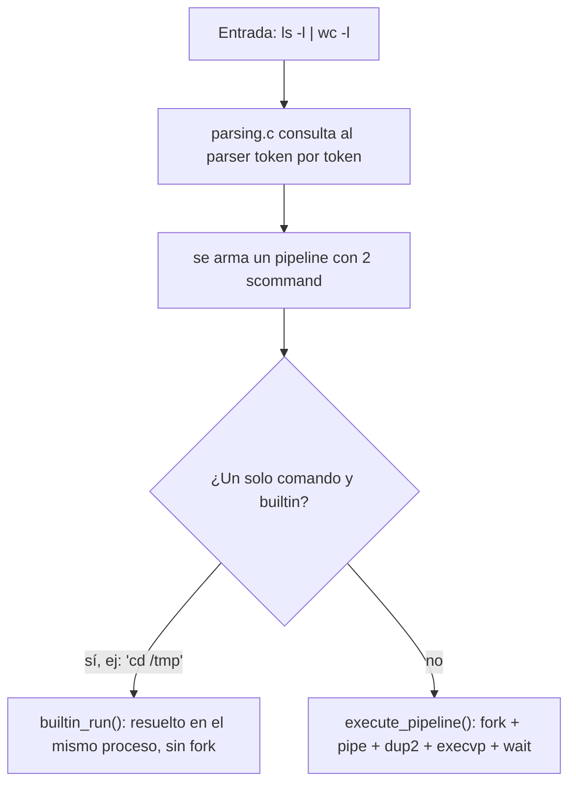

## 1. Shell vs. Kernel

El **shell** es un programa de espacio de usuario que interpreta lo que el usuario escribe y delega la ejecución real al **kernel**, que es quien tiene los privilegios para crear procesos, manejar archivos y acceder al hardware. El shell casi nunca ejecuta trabajo pesado por sí mismo: traduce el pedido a syscalls.

| | Shell | Kernel |
|---|---|---|
| Responsabilidad | Interpreta la entrada y la traduce en syscalls | Ejecuta las syscalls: crea procesos, maneja archivos y memoria |
| Espacio | Usuario (un programa más) | Kernel (permisos privilegiados) |

Si el binario de un comando externo no existe en disco, el shell no puede resolverlo — no "sabe" listar archivos por sí mismo, depende de que `ls` exista como programa.

### 1.1 Ciclo REPL

El shell es un bucle **Read-Evaluate-Print-Loop** que corre hasta `exit`:

```c
input = parser_new(stdin);
while (!quit) {
    show_prompt();
    // pipe = parse_pipeline(input);   // Read
    quit = parser_at_eof(input);
    /* Falta completar el Evaluate: execute_pipeline(pipe) */
}
parser_destroy(input);
```

### 1.2 Builtins vs. comandos externos

| | Builtin | Externo |
|---|---|---|
| Ejecutor | El shell mismo, función en C | Un proceso hijo nuevo |
| Ejemplos | `cd`, `help`, `exit` | `ls`, `grep`, `wc`, `gzip` |

`cd` tiene que ser builtin obligatoriamente: si corriera en un proceso hijo, el `chdir()` modificaría el directorio de trabajo del hijo, y al terminar ese hijo el cambio se pierde — el padre (el shell) nunca se entera. Por eso `cd` debe ejecutarse en el mismo proceso que el shell.

La tabla de despacho evita un `if/else if` por cada builtin:

```c
struct internal_commands {
    const char *name;
    void (*handler)(scommand);
};

static const struct internal_commands COMMANDS_TABLE[] = {
    {"cd",   handle_cd},
    {"help", handle_help},
    {"exit", handle_exit},
    {NULL,   NULL}
};

void handle_cd(scommand cmd) {
    scommand_pop_front(cmd);
    char *path = !scommand_is_empty(cmd) ? scommand_front(cmd) : getenv("HOME");
    if (path != NULL && chdir(path) != 0) {
        perror("cd");
    }
}
```

---

## 2. Gestión de procesos

### 2.1 `fork()`

```c
pid_t fork(void);
```

Duplica el proceso actual: memoria, estado y punto de ejecución. A partir del `fork()` hay dos procesos independientes ejecutando el mismo código desde el mismo punto. El valor de retorno distingue quién es quién:

- Hijo: retorna `0`.
- Padre: retorna el PID del hijo (`> 0`).
- Error: retorna `-1`, no se creó ningún proceso.

```c
pid_t pid = fork();
if (pid < 0) {
    perror("Error en la creacion de fork");
    exit(EXIT_FAILURE);
} else if (pid == 0) {
    // rama del hijo
} else {
    // rama del padre
}
```

`execute_pipeline()` en `execute.c` hace este `fork()` una vez por cada comando del pipeline.

### 2.2 `execvp()`

```c
int execvp(const char *file, char *const argv[]);
```

Reemplaza la imagen del proceso actual (código, memoria, stack) por la de otro programa, conservando el mismo PID. Si tiene éxito, no retorna — el código posterior a la llamada nunca se ejecuta, porque ese proceso ya es el nuevo programa. Si retorna, fue un error.

`fork()` + `execvp()` es la base de cualquier shell: el padre se duplica y le indica a la copia que ejecute otro programa; el padre sigue siendo el shell.

```c
if (pid == 0) {
    // redirecciones, si corresponde
    char **args = cmd_to_args(cmd);
    execvp(args[0], args);
    perror("Error en la ejecucion de execvp()");
    exit(EXIT_FAILURE);
}
```

### 2.3 `wait()` / `waitpid()` y procesos zombie

```c
pid_t wait(int *wstatus);
pid_t waitpid(pid_t pid, int *wstatus, int options);
```

- `wait(NULL)`: bloquea al padre hasta que termine **cualquiera** de sus hijos; no permite elegir cuál.
- `waitpid(pid, ...)`: espera a un hijo específico. Con la flag `WNOHANG` no bloquea — devuelve `0` de inmediato si el hijo todavía no terminó, lo que permite hacer polling de procesos en background sin congelar la terminal.

Un **proceso zombie** es un hijo que ya terminó pero cuyo padre todavía no llamó a `wait()`. El kernel mantiene el `exit status` en la tabla de procesos hasta que alguien lo reclama.

```c
for (int i = 0; i < tam; i++) {
    wait(NULL);
}
```

**Orfandad y adopción:** si el padre (`mybash`) muere antes que sus hijos, esos hijos (vivos o zombies) pasan a ser **huérfanos**. El kernel los reasigna de inmediato al proceso **PID 1** (`init`/`systemd`), que corre un `wait()` continuo sobre sus hijos adoptivos y los limpia apenas terminan — por eso un proceso huérfano no queda zombie indefinidamente.

### 2.4 Foreground vs. background

Sin `&`, el shell llama a `wait()` y bloquea el prompt hasta que el comando termina (**foreground**). Con `&` al final (`sleep 60 &`), el shell no espera y sigue leyendo comandos (**background**).

> El TAD `pipeline` tiene un campo `wait` que indica si corresponde esperar. Sin embargo, en `execute_pipeline()` el bucle final de `wait(NULL)` se ejecuta siempre, sin consultar ese campo — el diseño contempla background/foreground pero la implementación actual no lo usa para decidir.

---

## 3. Descriptores de archivo, pipes y redirecciones

### 3.1 Descriptores estándar

Todo proceso nace con tres descriptores de archivo (FD) abiertos:

| FD | Nombre | Equivalente en lenguajes de alto nivel |
|---|---|---|
| 0 | `stdin` | `input()` / `readline()` |
| 1 | `stdout` | `print()` / `console.log()` |
| 2 | `stderr` | `console.error()` |

Un FD **no** indica el tipo de operación (lectura/escritura/error): es únicamente un entero que el kernel asigna como etiqueta de una entrada abierta. Los permisos y el modo de apertura quedan fijados en el `open()` que generó ese FD, no en el número en sí. Por eso puede haber muchos FD simultáneos (3, 4, 5, ...) cada uno apuntando a un archivo o pipe distinto, con las flags que se usaron al abrirlo.

![[Pasted image 20260909211100.png]]
![[Pasted image 20260909211131.png]]
![[Pasted image 20260909213045.png]]
![[Pasted image 20260909213102.png]]

### 3.2 `pipe()`

```c
int pipe(int pipefd[2]);
```

Crea un canal unidireccional en memoria con dos extremos: `pipefd[0]` (lectura) y `pipefd[1]` (escritura). Todo lo escrito en el extremo 1 queda disponible para leer en el extremo 0, sin pasar por un archivo intermedio. Un pipeline de N comandos requiere `N - 1` pipes.

### 3.3 Redirecciones: `open()` + `dup2()` + `close()`

| Operador | FD destino | Efecto | Flags de `open()` |
|---|---|---|---|
| `<` | 0 (stdin) | Lee desde un archivo existente | `O_RDONLY` |
| `>` | 1 (stdout) | Trunca el archivo (o lo crea) y escribe | `O_WRONLY \| O_CREAT \| O_TRUNC` |
| `>>` | 1 (stdout) | Preserva contenido, escribe al final | `O_WRONLY \| O_CREAT \| O_APPEND` |
| `2>` | 2 (stderr) | Igual que `>` pero sobre stderr | `O_WRONLY \| O_CREAT \| O_TRUNC` |
| `<<` | 0 (stdin) | Here-doc: lee líneas de stdin hasta un delimitador | No usa `open()` |

`open()` le pide al kernel que abra o cree el archivo y devuelve el FD correspondiente; **no** es una operación de solo lectura de metadatos, y las flags determinan el modo real de apertura en disco.

`dup2(oldfd, newfd)` **no transmite datos**: sólo hace que `newfd` apunte a la misma entrada de la tabla de archivos abiertos que `oldfd`. Quien efectivamente mueve datos es el proceso que corre después (`write()`, `printf()`, o el propio `execvp()`, que hereda los FDs ya recableados). Se usa `dup2()` y no `dup()` porque se necesita fijar un número de FD específico (0, 1 o 2), no "el primero libre".

Secuencia genérica para `comando > archivo`:

```c
int fd = open("archivo", O_WRONLY | O_CREAT | O_TRUNC, 0644);
dup2(fd, STDOUT_FILENO);
close(fd);
```

`close(fd)` es necesario después del `dup2()` porque, aunque `newfd` y `oldfd` ya apuntan a lo mismo, el FD original queda redundante: consume una entrada del límite de descriptores por proceso, y si fuera el extremo de un pipe, dejarlo abierto evita que el otro extremo reciba la señal de EOF, bloqueando a otros procesos.

![[Pasted image 20260909213628.png]]

Redirección de entrada, tal como aparece en `execute.c`:

```c
if (scommand_get_redir_in(cmd) != NULL) {
    int entrada = open(scommand_get_redir_in(cmd), O_RDONLY);
    if (entrada == -1) { perror("Error al abrir archivo de entrada"); exit(EXIT_FAILURE); }
    dup2(entrada, STDIN_FILENO);
    close(entrada);
} else if (i > 0) {
    dup2(file_descriptor[i - 1][0], STDIN_FILENO);   // conexión con el pipe anterior
}
```

Redirección de salida, aplicada solo en el **último** comando del pipeline:

```c
if (scommand_get_redir_out(cmd) != NULL && i == cant_pipes) {
    int salida = open(scommand_get_redir_out(cmd), O_WRONLY | O_CREAT | O_TRUNC, 0644);
    dup2(salida, STDOUT_FILENO);
    close(salida);
} else if (i < cant_pipes) {
    dup2(file_descriptor[i][1], STDOUT_FILENO);   // conexión con el pipe siguiente
}
```

Los comandos intermedios de un pipeline nunca redirigen a archivo: siempre escriben al pipe siguiente. Después de armar las conexiones, cada hijo debe cerrar todos los extremos de pipe que no use:

```c
for (int j = 0; j < cant_pipes; j++) {
    close(file_descriptor[j][0]);
    close(file_descriptor[j][1]);
}
```

> El laboratorio implementa solo `<` y `>`. `>>` cambia únicamente la flag de apertura (`O_APPEND` en vez de `O_TRUNC`); `2>` cambia el FD destino a `STDERR_FILENO`.

### 3.4 Permisos octales (`0644`)

`0` indica base octal. `6` = propietario (`rw-` = lectura + escritura), `4` = grupo (`r--`), `4` = otros (`r--`).

---

## 4. Secuencias de syscalls por comando

Regla general para deducir la secuencia:
1. Cantidad de comandos separados por `|` → esa cantidad de `fork()` + `execvp()`.
2. Más de un comando → `pipe()` × (N-1).
3. Hay `<` o `>` → `open()` + `dup2()` + `close()` en el proceso correspondiente.
4. Termina en `&` → el padre no llama a `wait()`.
5. Si no es background → el padre hace `wait()` por cada hijo.

**`gzip Lab1G04.tar`**
```
fork()
  hijo: execvp("gzip", ["gzip","Lab1G04.tar",NULL])
padre: wait(NULL)
```

**`ls -l > out.txt`**
```
fork()
  hijo: open("out.txt", O_WRONLY|O_CREAT|O_TRUNC, 0644) -> dup2(fd, STDOUT) -> close(fd)
        execvp("ls", ["ls","-l",NULL])
padre: wait(NULL)
```

**`xeyes &`**
```
fork()
  hijo: execvp("xeyes", ["xeyes",NULL])
padre: (no llama a wait)
```

**`ls -l | wc -l`**
```
pipe(fd)                      // fd[0]=lectura, fd[1]=escritura

fork() -> hijo 1 (ls -l)
  dup2(fd[1], STDOUT); close(fd[0]); close(fd[1])
  execvp("ls", ["ls","-l",NULL])

fork() -> hijo 2 (wc -l)
  dup2(fd[0], STDIN); close(fd[0]); close(fd[1])
  execvp("wc", ["wc","-l",NULL])

padre: close(fd[0]); close(fd[1])
       wait(NULL); wait(NULL)
```

**`cat file.txt | grep 'a' > out.txt &`**
```
pipe(fd)

fork() -> hijo 1 (cat file.txt)
  dup2(fd[1], STDOUT); close(fd[0]); close(fd[1])
  execvp("cat", ["cat","file.txt",NULL])

fork() -> hijo 2 (grep 'a' > out.txt)
  dup2(fd[0], STDIN)
  open("out.txt", O_WRONLY|O_CREAT|O_TRUNC, 0644) -> dup2(fd_out, STDOUT) -> close(fd_out)
  close(fd[0]); close(fd[1])
  execvp("grep", ["grep","a",NULL])

padre: close(fd[0]); close(fd[1])
       (no espera, terminó en "&")
```

### 4.1 Casos con `head -n 5` y `stats.txt`

**`ls -l | head -n 5 > stats.txt`**
1. `pipe(pipefd)` en el padre.
2. Hijo 1 (`ls`): `dup2(pipefd[1], STDOUT)`, cierra ambos extremos del pipe, `execvp("ls", ...)`.
3. Hijo 2 (`head`): `dup2(pipefd[0], STDIN)`; `open("stats.txt", O_WRONLY|O_CREAT|O_TRUNC, 0644)`; `dup2(fd_stats, STDOUT)`; `close(fd_stats)` y cierre de los extremos de pipe sobrantes; `execvp("head", ["head","-n","5",NULL])`.
4. Padre: cierra ambos extremos del pipe y hace `waitpid()` sobre los dos hijos.

**`ls -l | head -n 5 < stats.txt`**
Misma secuencia de `pipe()`/`fork()`/`execvp()`, pero en el hijo de `head`: `open("stats.txt", O_RDONLY)` seguido de `dup2(fd_stats, STDIN)`. Este segundo `dup2` pisa la conexión que venía del pipe, así que `head` termina leyendo del archivo y no de `ls`.

**`ls -l | head -n 5 << stats.txt`**
`<<` no es una redirección de archivo: es un **here-document**. La shell no abre `stats.txt`, sino que bloquea esperando líneas por teclado hasta encontrar el delimitador literal `stats.txt`. El proceso queda colgado hasta que se escribe ese delimitador o se interrumpe con `SIGINT` (`Ctrl+C`).

**`ls -l | head -n 5 >> stats.txt`**
Idéntico al primer caso, con la única diferencia de que el hijo de `head` abre el archivo con `open("stats.txt", O_WRONLY|O_CREAT|O_APPEND, 0644)`: preserva el contenido previo y escribe a partir del final en lugar de truncar.

---

## 5. Manejo de strings en C

Un string en C es un arreglo de `char` terminado en `\0`; no existe metadata de longitud, por lo que conocerla implica recorrer el arreglo hasta encontrar el terminador.

| Función | Comportamiento |
|---|---|
| `strlen(s)` | Cuenta caracteres hasta `\0` |
| `strcpy(dst, src)` | Copia `src` sobre `dst` |
| `strcat(dst, src)` | Concatena `src` al final de `dst` |
| `strcmp(s1, s2)` | Comparación lexicográfica; `0` si son iguales |

`strcpy()` y `strcat()` no verifican espacio disponible en el destino: escribir más allá del buffer asignado es un **buffer overflow**, uno de los vectores de explotación más conocidos en C, porque puede sobrescribir memoria adyacente (otras variables o estructuras de control del programa).

`strmerge()` evita el problema reservando el buffer exacto antes de copiar:

```c
char * strmerge(char *s1, char *s2) {
    char *merge = NULL;
    size_t len_s1 = strlen(s1);
    size_t len_s2 = strlen(s2);
    merge = calloc(len_s1 + len_s2 + 1, sizeof(char));   // +1 para el '\0'
    strncpy(merge, s1, len_s1);
    merge = strncat(merge, s2, len_s2);
    return merge;
}
```

A diferencia de `strcat()`, que asume espacio disponible en el destino, `strmerge()` calcula el tamaño exacto y reserva memoria dinámica — que debe liberarse con `free()` cuando deja de usarse.

Para listas (por ejemplo, los argumentos de un comando) el código usa **GLib** (`GList`) en vez de listas enlazadas manuales:

```c
struct scommand_s {
    GList * args;       // "ls" -> "-l" -> "/tmp"
    char * redir_in;
    char * redir_out;
};
```

---

## 6. Arquitectura de MyBash

| Módulo | Responsabilidad |
|---|---|
| `mybash.c` | Ciclo principal (REPL) |
| `parser.h` | Análisis léxico de la entrada (provisto por la cátedra) |
| `parsing.c` | Usa el `parser` para construir el TAD `pipeline` |
| `command.c/h` | Definición de los TADs `scommand` y `pipeline` |
| `execute.c` | Orquesta `fork`, `execvp`, `pipe` y redirecciones |
| `builtin.c` | Resuelve `cd`, `help`, `exit` sin crear procesos |

### 6.1 TADs

```c
struct scommand_s {
    GList * args;
    char * redir_in;    // NULL si no hay "<"
    char * redir_out;   // NULL si no hay ">"
};

struct pipeline_s {
    GList * scmds;       // scommand1 -> scommand2 -> ...
    bool wait;            // false si terminó en "&"
};
```

### 6.2 `parser` vs. `parsing`

`parser` es el analizador de bajo nivel (provisto, no se modifica): reconoce palabras, redirecciones y pipes token por token, sin conocer `scommand` ni `pipeline`. `parsing.c` consume esa API para construir la estructura completa:

```c
static scommand parse_scommand(Parser p) {
    scommand cmd = scommand_new();
    arg_kind_t arg;
    char *comando = parser_next_argument(p, &arg);
    while (comando != NULL) {
        if (arg == ARG_INPUT)       scommand_set_redir_in(cmd, comando);
        else if (arg == ARG_NORMAL) scommand_push_back(cmd, comando);
        else if (arg == ARG_OUTPUT) scommand_set_redir_out(cmd, comando);
        free(comando);
        comando = parser_next_argument(p, &arg);
    }
    return cmd;
}
```

> `command.h` indica que `scommand` toma posesión del puntero que se le pasa (no copia). El `free(comando)` inmediatamente después de guardarlo amerita revisión con `make test-parsing`: a primera vista libera algo que el `scommand` todavía referencia.

### 6.3 Flujo completo



### 6.4 Puntos a repasar

- `mybash.c`, en su estado actual, no llama a `parse_pipeline` ni a `execute_pipeline` (esqueleto a completar).
- La redirección de salida (`>`) solo aplica al último comando del pipeline.
- `execute_pipeline()` siempre hace `wait()` sobre todos los hijos, sin consultar el campo `wait` del pipeline.

---

## 7. Lab 0 — uso de la terminal

Comandos externos encadenados con `|`, que MyBash también debe poder ejecutar.

```bash
cat /proc/cpuinfo | grep "name" | head -n 1      # modelo de CPU
cat /proc/cpuinfo | grep "name" | wc -l           # cantidad de cores
curl -s URL | cut -d ';' -f2 | tr 'A-Z' 'a-z' | sed -e 's/ /_/g' -e '1d' -e '/^$/d' > usuarios.txt
sort -k 5nr datos.in | head -n 1                  # máximo de la columna 5
awk '{print $0, $7-$8}' tabla.in                  # agrega la resta de dos columnas
ip link show | grep -oE "([a-fA-F0-9]{2}:){5}[a-fA-F0-9]{2}" | grep -v "00:00:00:00:00:00"
touch serie{01..10}.srt
for i in {01..10}; do mv serie${i}_es.srt serie${i}.srt; done
ffmpeg -i video.mp4 -ss 00:00:05 -to 00:00:30 -c copy recorte.mp4
```

- `cut -d ';' -f2`: columna 2 de un archivo separado por `;`.
- `sed 's/ /_/g'`: reemplaza espacios por guiones bajos; `1d` borra la primera línea; `/^$/d` borra líneas vacías.
- `sort -k Nnr`: ordena por la columna N, numérico (`n`) y descendente (`r`).
- `grep -oE`: imprime solo la parte que matchea el patrón; `grep -v`: invierte el filtro.
- `{01..10}`: expansión de llaves — la shell la resuelve antes de invocar el comando.

---

## 8. Preguntas de examen resueltas

**¿Qué FD modifica `comando 2> errores.log` y hacia dónde apunta?**
Modifica el FD 2 (`stderr`). Tras el `dup2()`, el FD 2 apunta a `errores.log`.

**¿Por qué `close(fd_abierto)` inmediatamente después de `dup2(fd_abierto, STDOUT_FILENO)`?**
Porque quedan dos FDs (el original y `STDOUT_FILENO`) apuntando a la misma entrada de la tabla de archivos abiertos, y el original ya es redundante. Mantenerlo abierto consume descriptores del límite por proceso y, si es un extremo de pipe, puede impedir que se propague el EOF, bloqueando a otros procesos.

**¿Por qué `cat < entrada.txt` preserva el contenido y `cat > entrada.txt` lo vacía?**
`<` abre el archivo con `O_RDONLY`: solo lectura, sin modificar el contenido. `>` abre con `O_WRONLY | O_CREAT | O_TRUNC`: la flag `O_TRUNC` trunca el archivo a 0 bytes antes de escribir.

**¿Qué es `<<` y por qué `ls -l | head -n 5 << stats.txt` se queda esperando entrada?**
`<<` es un here-document, no una redirección de archivo. La shell no abre ningún archivo: bloquea leyendo líneas desde el teclado hasta encontrar el delimitador literal (`stats.txt`). Se interrumpe con `Ctrl+C` (señal `SIGINT`).

---

## Apéndice — Tabla de syscalls

| Syscall | Retorno OK | Retorno error |
|---|---|---|
| `fork()` | `0` en el hijo, PID del hijo en el padre | `-1` |
| `execvp()` | No retorna si tiene éxito | `-1` |
| `wait(int *wstatus)` | PID del hijo que terminó (no se puede elegir cuál) | `-1` |
| `waitpid(pid, wstatus, options)` | PID esperado; con `WNOHANG`, `0` si el hijo aún no terminó | `-1` |
| `pipe(int pipefd[2])` | `0` | `-1` |
| `open(pathname, flags, ...)` | FD del archivo | `-1` |
| `close(fd)` | `0` | `-1` |
| `dup(oldfd)` / `dup2(oldfd, newfd)` | Nuevo FD | `-1` |

```c
pid_t fork(void);
int   execvp(const char *file, char *const argv[]);
pid_t wait(int *wstatus);
pid_t waitpid(pid_t pid, int *wstatus, int options);
int   pipe(int pipefd[2]);
int   open(const char *pathname, int flags, ...);
int   close(int fd);
int   dup(int oldfd);
int   dup2(int oldfd, int newfd);
```

**Flags de `open()` (`fcntl.h`) por operador:**

| Operador | Target | Flags |
|---|---|---|
| `<` | stdin (0) | `O_RDONLY` |
| `>` | stdout (1) | `O_WRONLY \| O_CREAT \| O_TRUNC` |
| `>>` | stdout (1) | `O_WRONLY \| O_CREAT \| O_APPEND` |
| `2>` | stderr (2) | `O_WRONLY \| O_CREAT \| O_TRUNC` |
| `<<` | stdin (0) | No usa `open()` (here-doc) |

**Material de la cátedra:**
Presentación: https://drive.google.com/file/d/12smrFtlB1AJO1eP0kfG62rWZsaID5vm8/view
Video: https://youtu.be/bT1D2p8uV8Q
